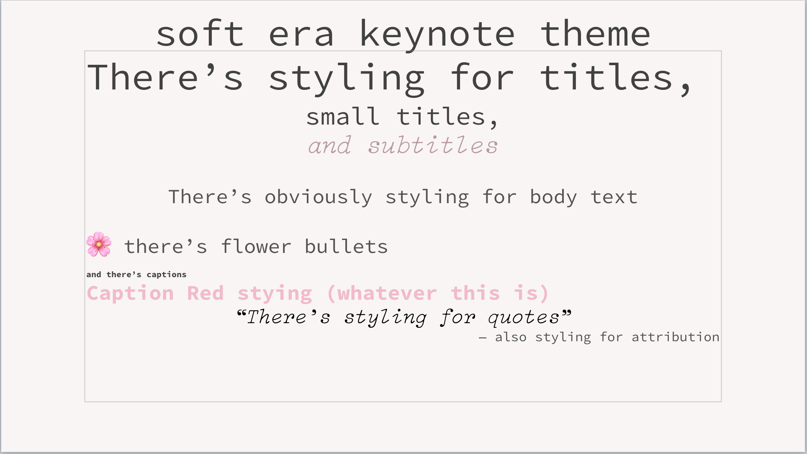

# \~ soft era \~

### Apple Keynote Soft Era Theme

🌸 Apple Keynote Theme based on the design of the [Soft Aesthetic Club] website(http://soft-aesthetic.club). 🌱

\~.\~
 &nbsp;&nbsp;a soft, warm, low contrast keynote theme,
 &nbsp;&nbsp;with pastel accents that are easy on your eyes
 &nbsp;&nbsp;and emoji flower bullets! 🌸

^.^
 &nbsp;&nbsp;make stuff and learn.
 &nbsp;&nbsp;make the world your kinda place.
 &nbsp;&nbsp;take care of the people around you

🌿

## Installation

- Double-click the soft_era.kth theme file, then click Add to Theme Chooser 
- If you want to install the theme on an iOS device, just save the file to iCloud, select it from the Files app, and then tap "Open in Keynote"
- The theme uses the fonts "Source Code Pro" (available on Google Fonts), and "Select Mono Italic", which is available from [Michael McMaster](http://michaeljmcmaster.com/selectmono)

💾 enjoy <3

---

based on colors provided by [@animalphase](https://twitter.com/animalphase)
and the [Soft Aesthetic Club] website(http://soft-aesthetic.club)