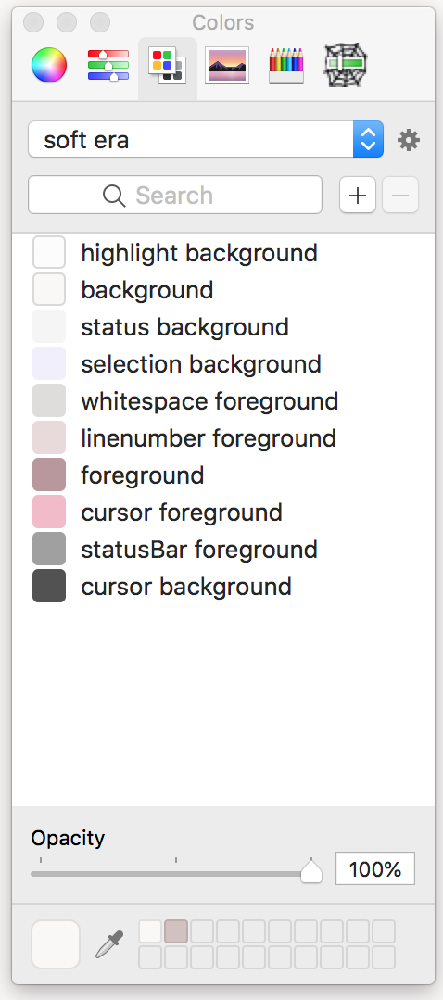

# \~ soft era \~

### Mac OS X Color Palette

🌸 Light pastel color palette for soft, warm, cozy, cute anything. 🌱

\~.\~
 &nbsp;&nbsp;a soft, warm, low contrast color palette,
 &nbsp;&nbsp;with pastel accents that are easy on your eyes

^.^
 &nbsp;&nbsp;make stuff and learn.
 &nbsp;&nbsp;make the world your kinda place.
 &nbsp;&nbsp;take care of the people around you

🌿

## Installation

- Copy the soft_era.clr file to ~/Library/Colors/ 
- Launch any Cocoa app that has a color picker
- Click on the color wheel button
- Click on the "Color Palettes" menu (it looks like two pages of color swatches) 
- Select `soft era` from the dropdown menu

💾 enjoy <3

---

based on colors provided by [@animalphase](https://twitter.com/animalphase)
