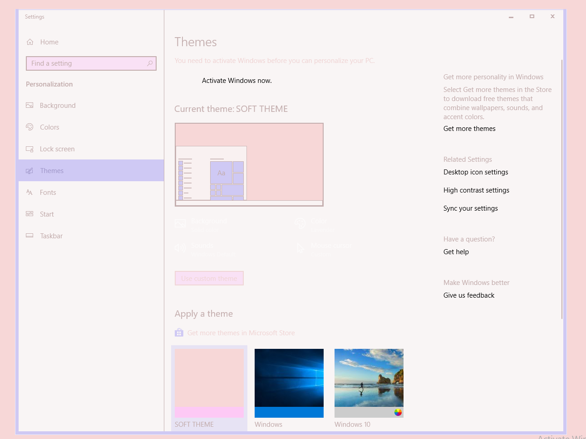

# \~ soft era \~

### Windows Theme

🌸 Light pastel theme for cozy, cute coding. 🌱

\~.\~
 &nbsp;&nbsp;a soft, warm, low contrast theme,
 &nbsp;&nbsp;with pastel accents that are easy on your eyes

^.^
 &nbsp;&nbsp;make stuff and learn.
 &nbsp;&nbsp;make the world your kinda place.
 &nbsp;&nbsp;take care of the people around you
## Installation

Download one of the .theme files onto the computer, then run them!

Simple as that!

-----------------

*Low Contrast theme*: Changes color scheme of Windows Explorer, and most border colors. Will not modify Visual studio or other programs outside normal windows configuration.

*High Contrast Theme*: Changes everything in Windows that can be affected, to soft-era color scheme.  (May have some slight black spotting in places)

-----------------

If you want to to tweak the colors of anyting, you can open up the .theme files with any text editor.  
Changes will only be reflected after you save and fully reload the theme by selecting another theme and returning to it. 

🌿

💾 enjoy <3

---

Based on colours by [@animalphase](https://twitter.com/animalphase)
